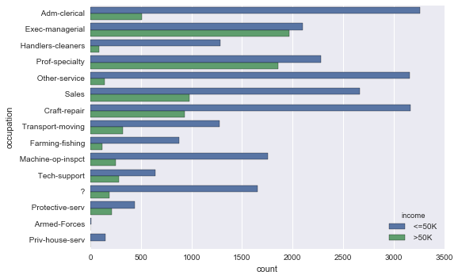
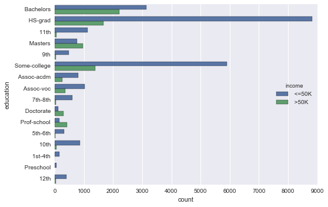
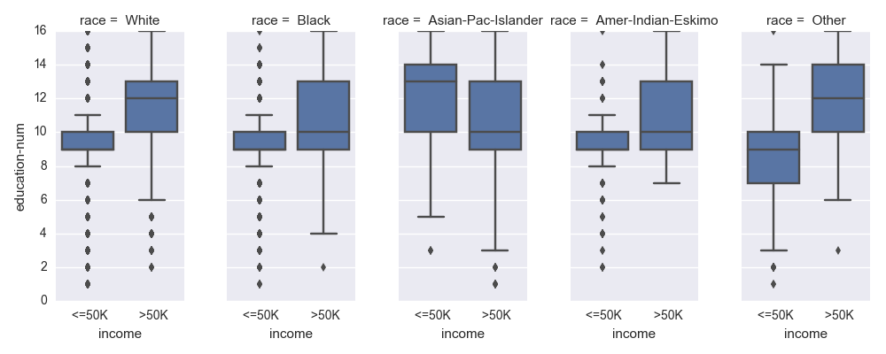
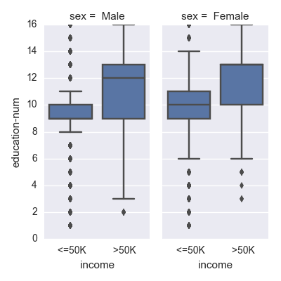
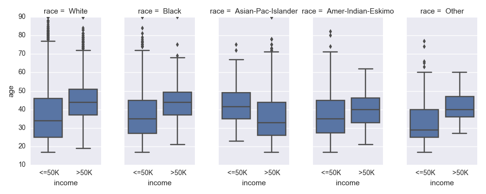
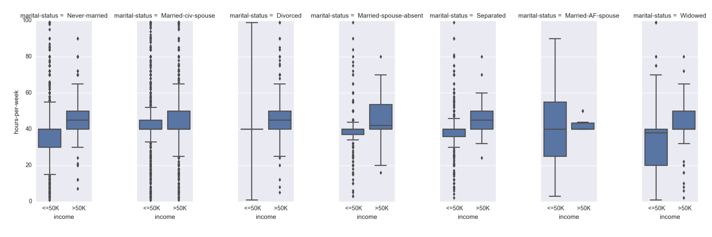
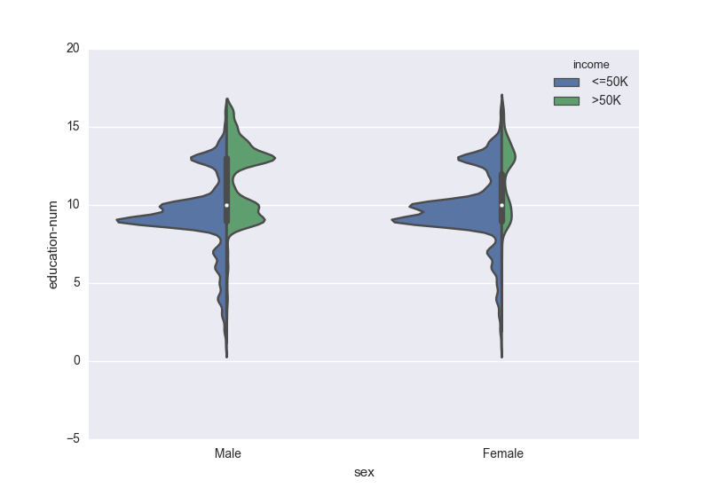
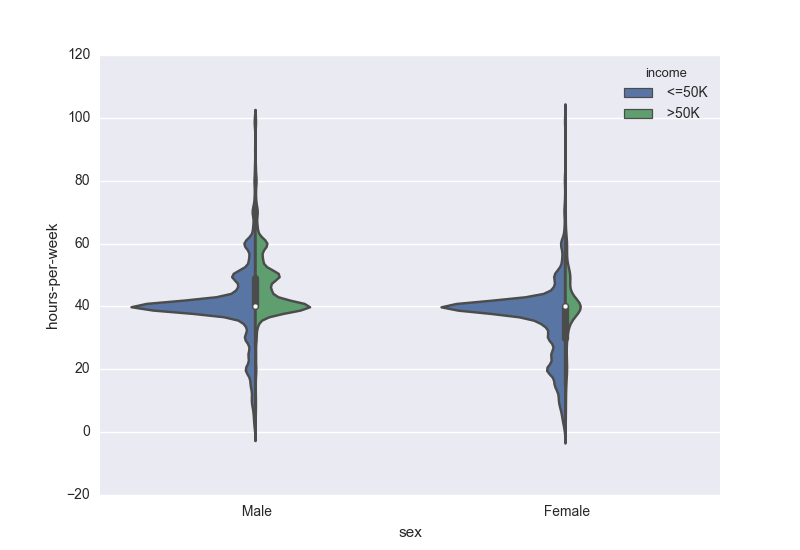
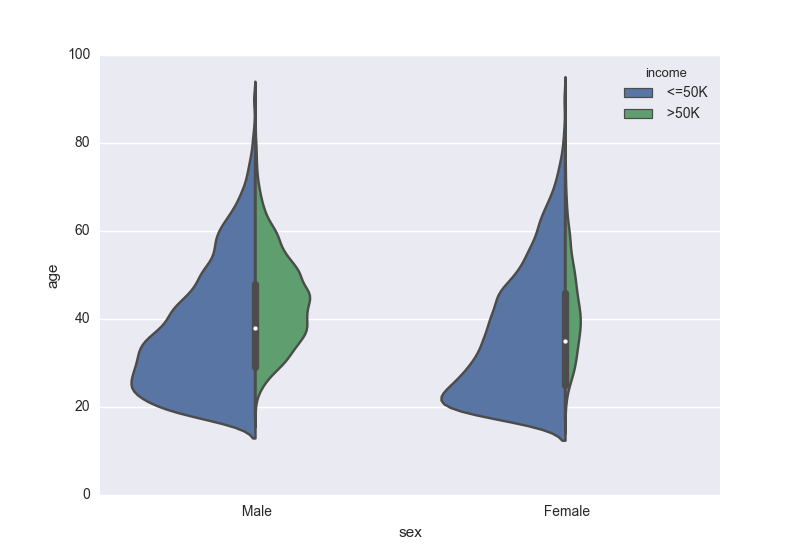

# Predicting Income, Part 1: Feature Analysis and Selection for Machine Learning
**An end-to-end machine learning example using Pandas and Scikit-Learn**    
_by Benjamin Bengfort and Rebecca Bilbro, adapted from a [post](http://blog.districtdatalabs.com/building-a-classifier-from-census-data) originally written for the [District Data Labs blog](http://blog.districtdatalabs.com/)_      

One of the first steps for many of those to getting into data science is learning how to build simple machine learning models using an open data set. For those who are interested in experimenting with building classification, regression, or clustering models, the [UCI Machine Learning Repository](http://archive.ics.uci.edu/ml/index.html) is a great resources for open datasets that have already been conveniently categorized by the most appropriate machine learning tasks.

This tutorial will provide an end-to-end example of how to do just that using the Python programming language. In particular, we will demonstrate all the steps needed to build a binary classifier that can use Census data to determine whether or not a person, based on their demographics, is likely to make an income of $50k per year. We'll start by ingesting data from the UCI website, performing some initial exploratory analyses to get a sense for what's in the data, structure the data to fit a Scikit-Learn model, and then evaluate the results. Although the UCI repository does give advice as to what types of machine learning might be applied, we'll see through the tutorial that there is still much data wrangling and clever programming needed in order to create an effective classifier.

For those new to machine learning or to Scikit-Learn, we hope this is a practical example that may shed light on many challenges that crop up when developing predictive models. For more experienced readers, we hope that we can challenge you to try this workshop and refine the classifier or the command line application!

## Getting Started

### Step 1: Preliminaries
**Libraries and Utilities**    
We’ll be using the following tools in this tutorial:

```python
# Standard Python libraries
import os                                    # For accessing operating system functionalities
import json                                  # For encoding and decoding JSON data
import pickle                                # For serializing and de-serializing Python objects

# Libraries that can be pip installed
import requests                              # Simple Python library for HTTP
import pandas as pd                          # Library for building dataframes similar to those in R
import seaborn as sns                        # Statistical visualization library based on Matplotlib
import matplotlib.pyplot as plt              # MATLAB-like plotting, useful for interactive viz

# Utilities needed from Scikit-Learn, a robust, comprehensive machine learning library in Python.
# We'll discuss each of these in detail as we come to them in the tutorial.
from sklearn.pipeline import Pipeline
from sklearn.datasets.base import Bunch
from sklearn.metrics import classification_report
from sklearn.linear_model import LogisticRegression
from sklearn.preprocessing import Imputer, LabelEncoder
from sklearn.base import BaseEstimator, TransformerMixin
```

### Step 2: Obtaining data
The next step is to use the UCI Machine Learning Repository to find a non-trivial dataset with which to build a model. While the example datasets included with Scikit-Learn are good examples of how to fit models, they do tend to be either trivial or overused. It's a bit more of a challenge to conduct a predictive exercise with a novel dataset that has several (more than 10) features and many instances (more than 10,000). There are around 350 datasets in the repository, categorized by things like task, attribute type, data type, area, or number of attributes or instances.

For this tutorial, we selected a [Census Income](http://archive.ics.uci.edu/ml/datasets/Census+Income) dataset that had 14 attributes and 48,842 instances. The hypothesis is that it is possible to predict a person's income level based upon their personal attributes, like gender, education level, and marital status as well as their job titles. The suggested task is to build a binary classifier that can determine from the Census information whether or not a person makes more or less than $50k per year.

Every dataset in the UCI repository comes with a link to the data folder, which you can click on to download the data directly to your computer. However, in an effort to make it easier to follow along, we've also included a simple `download_data` function that uses the handy Python `requests` library to fetch the data:

```python
CENSUS_DATASET = (
    "http://archive.ics.uci.edu/ml/machine-learning-databases/adult/adult.data",
    "http://archive.ics.uci.edu/ml/machine-learning-databases/adult/adult.names",
    "http://archive.ics.uci.edu/ml/machine-learning-databases/adult/adult.test",
)

def download_data(path='data', urls=CENSUS_DATASET):
    if not os.path.exists(path):
        os.mkdir(path)

    for url in urls:
        response = requests.get(url)
        name = os.path.basename(url)
        with open(os.path.join(path, name), 'w') as f:
            f.write(response.content)

download_data()
```

This code also helps us start to think about how we're going to manage our data on disk. We've created a `data` folder in our current working directory to hold the data as it's downloaded. Later, in the data management section of this post, we'll expand this folder to be loaded as a `Bunch` object. `Bunches` are objects native to Scikit-Learn and are merely a simple holder with fields that can be both accessed as Python `dict` keys or object attributes for convenience (for example, "target_names" will hold the list of the names of all the labels).

## Data Exploration
The next thing to do is to explore the dataset and see what's inside. The three files that we downloaded do not have a file extension, but they are simple text files. You can change the extension to `.txt` for easier exploration if that helps. By using the `head` and `wc -l` commands on the command line, our files appear to be as follows:

- `adult.data`: A CSV dataset containing 32,562 rows and no header.    
- `adult.names`: A text file containing meta information about the dataset.    
- `adult.test`: A CSV dataset containing 16,283 rows with a weird first line.    

Because the data has already been divided into a test and training set, this dataset is clearly intended to be used for machine learning. Similar types of split datasets are used for [Kaggle](https://www.kaggle.com/) competitions and academic conferences. This will save us a step when it comes to evaluation time.

Since we already have a CSV file, let's explore the dataset using Pandas. Because the CSV data doesn't have a header row, we will have to supply the names directly to the `pd.read_csv` function. To get these names, we manually transcribe the list from the `adult.names` file. In the future, we'll store these names as a machine readable JSON file so that we don't have to construct the list manually each time.    

```python
names = [
    'age',
    'workclass',
    'fnlwgt',
    'education',
    'education-num',
    'marital-status',
    'occupation',
    'relationship',
    'race',
    'sex',
    'capital-gain',
    'capital-loss',
    'hours-per-week',
    'native-country',
    'income',
]
# Note: We use a regex trick here for the separator below because the test data
# have a period appended to the end of the class names.
data = pd.read_csv('data/adult.data', sep="\s*,", names=names)
print data.head()
```

Here's the result:    

<div>
<table border="1" class="dataframe">
  <thead>
    <tr style="text-align: right;">
      <th></th>
      <th>age</th>
      <th>workclass</th>
      <th>fnlwgt</th>
      <th>education</th>
      <th>education-num</th>
      <th>marital-status</th>
      <th>occupation</th>
      <th>relationship</th>
      <th>race</th>
      <th>sex</th>
      <th>capital-gain</th>
      <th>capital-loss</th>
      <th>hours-per-week</th>
      <th>native-country</th>
      <th>income</th>
    </tr>
  </thead>
  <tbody>
    <tr>
      <th>0</th>
      <td>39</td>
      <td>State-gov</td>
      <td>77516</td>
      <td>Bachelors</td>
      <td>13</td>
      <td>Never-married</td>
      <td>Adm-clerical</td>
      <td>Not-in-family</td>
      <td>White</td>
      <td>Male</td>
      <td>2174</td>
      <td>0</td>
      <td>40</td>
      <td>United-States</td>
      <td>&lt;=50K</td>
    </tr>
    <tr>
      <th>1</th>
      <td>50</td>
      <td>Self-emp-not-inc</td>
      <td>83311</td>
      <td>Bachelors</td>
      <td>13</td>
      <td>Married-civ-spouse</td>
      <td>Exec-managerial</td>
      <td>Husband</td>
      <td>White</td>
      <td>Male</td>
      <td>0</td>
      <td>0</td>
      <td>13</td>
      <td>United-States</td>
      <td>&lt;=50K</td>
    </tr>
    <tr>
      <th>2</th>
      <td>38</td>
      <td>Private</td>
      <td>215646</td>
      <td>HS-grad</td>
      <td>9</td>
      <td>Divorced</td>
      <td>Handlers-cleaners</td>
      <td>Not-in-family</td>
      <td>White</td>
      <td>Male</td>
      <td>0</td>
      <td>0</td>
      <td>40</td>
      <td>United-States</td>
      <td>&lt;=50K</td>
    </tr>
    <tr>
      <th>3</th>
      <td>53</td>
      <td>Private</td>
      <td>234721</td>
      <td>11th</td>
      <td>7</td>
      <td>Married-civ-spouse</td>
      <td>Handlers-cleaners</td>
      <td>Husband</td>
      <td>Black</td>
      <td>Male</td>
      <td>0</td>
      <td>0</td>
      <td>40</td>
      <td>United-States</td>
      <td>&lt;=50K</td>
    </tr>
    <tr>
      <th>4</th>
      <td>28</td>
      <td>Private</td>
      <td>338409</td>
      <td>Bachelors</td>
      <td>13</td>
      <td>Married-civ-spouse</td>
      <td>Prof-specialty</td>
      <td>Wife</td>
      <td>Black</td>
      <td>Female</td>
      <td>0</td>
      <td>0</td>
      <td>40</td>
      <td>Cuba</td>
      <td>&lt;=50K</td>
    </tr>
  </tbody>
</table>
</div>

Our Pandas dataframe provides us with a convenient method for starting to unpack the data that we have to work with to generate our predictions and to select our features. With feature selection, our goal is to find the smallest set of the available features such that the fitted model will reach it's maximal predictive value. Why? Firstly, minimizing the number of features we include lowers the complexity of the model, in turn reducing bias. Secondly, lower dimensional data takes a lot less computation time. Finally, in practice, models based on smaller sets of variables are frequently also more interpretable.

But how can we decide which features are necessary and which are redundant? What's the strongest determinant of income &mdash; age, race, or gender? What about education, industry sector, or marital status? Generally with data that is numeric, we use descriptive statistics to explore central tendency, standard deviations, and multicollinearity. However, we can see by glancing at the first 5 rows of our dataframe that we primarily have categorical data (and even with continuous data, [statistical methods alone can prove insufficient](https://en.wikipedia.org/wiki/Anscombe%27s_quartet)), so instead we'll use some visual feature analysis tricks.

## Visual Feature Analysis
Feature analysis is key to successful feature selection for machine learning. Some common approaches to visualizing features to support machine learning, [which you can read more about here](https://districtdatalabs.silvrback.com/visual-diagnostics-for-more-informed-machine-learning-part-1), include boxplots, histograms, scatterplot matrices, and radial visualizations.     

Our target, `data.income` is currently constructed as a categorical field. It would be interesting to see the frequencies of each class, relative to the target of our classifier. To do this, we can use the `countplot` function from the Python visualization package Seaborn to count the occurrences of each data point. Let's take a look at the counts of different categories in `data.occupation` and in `data.education` &mdash; two likely predictors of income in the Census data:

```python
sns.countplot(y='occupation', hue='income', data=data,)
sns.plt.show()
```




```python
sns.countplot(y='education', hue='income', data=data,)
sns.plt.show()
```




The `countplot` function accepts either an `x` or a `y` argument to specify if this is a bar plot or a column plot. We chose to use the `y` argument so that the labels would be readable. The `hue` argument specifies a column for comparison; in this case we're concerned with the relationship of our categorical variables to the target income. Go ahead and explore other variables in the dataset, for example `data.race` and `data.sex` to see if those values are predictive of the level of income or not!

Next, you can start using some more advanced visual analysis tools to explore multiple features simultaneously to see if they are related to each other. For example, it would be useful to know if years of education correlates equally well with income for people of all races. When we use a faceted boxplot graph to disaggregate by race, we can see that more years of education does _not_ result in the same gains in income for Asian Americans/Pacific Islanders and Native Americans compared with Caucasians:    
```python
g = sns.FacetGrid(data, col='race', size=4, aspect=.5)
g = g.map(sns.boxplot, 'income', 'education-num')
sns.plt.show()
```


Or let's say we wanted to see how years of education correlates with income for men and for women:    
```python
g = sns.FacetGrid(data, col='sex', size=4, aspect=.5)
g = g.map(sns.boxplot, 'income', 'education-num')
sns.plt.show()
```


The plot above shows us that more education also does not result in the same gains in income for women compared with men.

Since age seems like a likely predictor of income level, it would be useful to know if age is equally predictive for all people. We can use small multiple plots to see how age correlates with income, disaggregated by race:    
```python
g = sns.FacetGrid(data, col='race', size=4, aspect=.5)
g = g.map(sns.boxplot, 'income', 'age')
sns.plt.show()
```


As expected, older people generally tend to make more, though that does not appear to hold true for Asian Americans/Pacific Islanders in this dataset.

Number of hours worked is another interesting feature that might predict income, so before we build our classifier, we might want to use another set of boxplots to examine how hours worked per week correlate with income, disaggregated by another feature such as marital status:    
```python
g = sns.FacetGrid(data, col='marital-status', size=4, aspect=.5)
g = g.map(sns.boxplot, 'income', 'hours-per-week')
sns.plt.show()
```


Violinplots are often a useful alternative to box-and-whisker plots because they can integrate the information from a traditional boxplot with a kernel density estimate. For example, the two plots below enable us to see the distribution of years of education, hours worked per week, and age for men and women with annual incomes both above and below $50,000.

```python
sns.violinplot(x='sex', y='education-num', hue='income', data=data, split=True, scale='count')
sns.plt.show()

sns.violinplot(x='sex', y='hours-per-week', hue='income', data=data, split=True, scale='count')
sns.plt.show()

sns.violinplot(x='sex', y='age', hue='income', data=data, split=True, scale='count')
sns.plt.show()
```




These types of visual analyses can be very useful for unpacking an unfamiliar dataset with which one does not have domain expertise, and already we developed several hypotheses for the kinds of combinations of features that are likely to predict a person's income level.

## Next Steps
While Part 1 of this tutorial has focused on how to unpack and explore a dataset to prepare for machine learning, Part 2 will move on to demonstrating how to set up the data management, extraction, encoding, and transformation needed to power our command line application. For example, because we will be using the machine learning library Scikit-Learn to generate our predictions, our next steps will include transforming our feature vectors into a form that can be computed upon numerically (which is required for the Scikit-Learn API). We'll do this in a systematic way that can support the kind of robust, automated ingestion-and-prediction cycle that would be required for a machine-learning based application. We'll also introduce the concept of "pipelines" as a way to systemize the series of steps in the machine learning workflow that transform raw data into a data product, and which represent an important step away from machine learning for research purposes and towards an operationalized framework for machine learning.

Check out Part 2 [here](https://github.com/CommerceDataService/tutorial-predicting-income/blob/master/predicting_income_with_census_data_pt2.md)!
