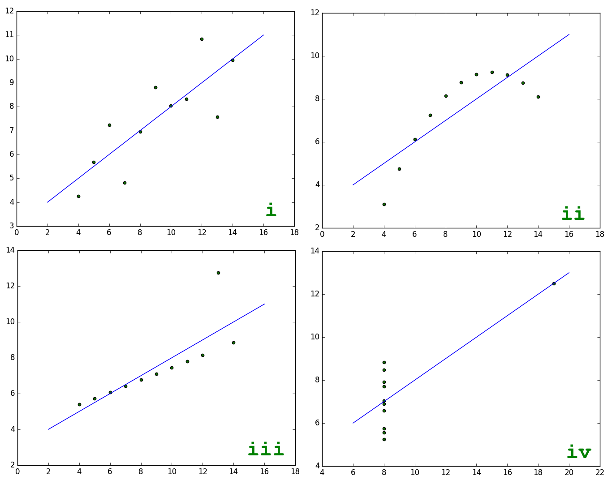
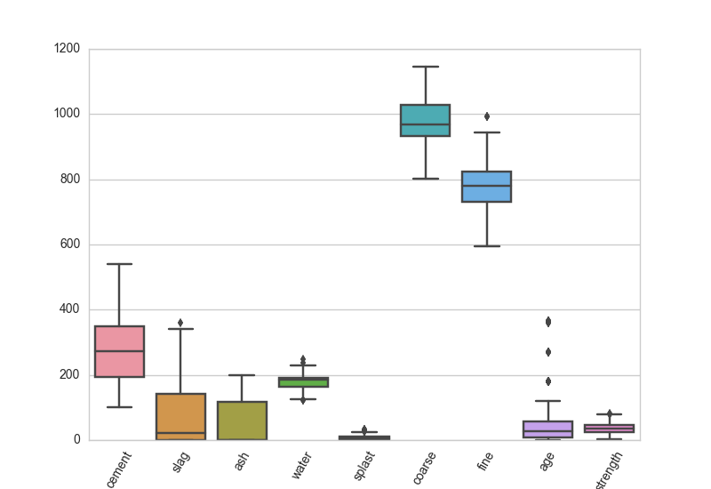
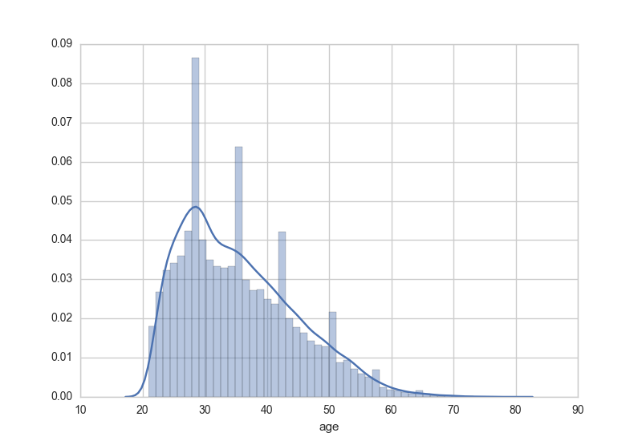
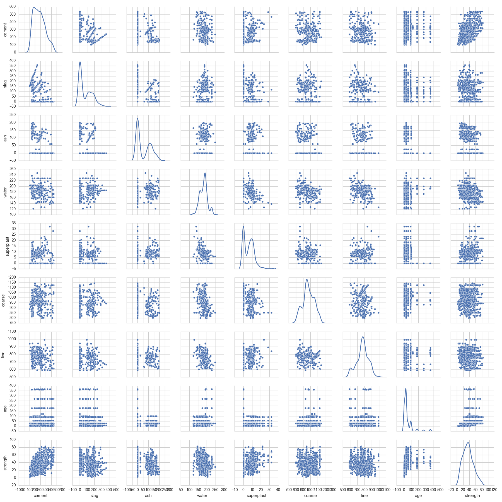
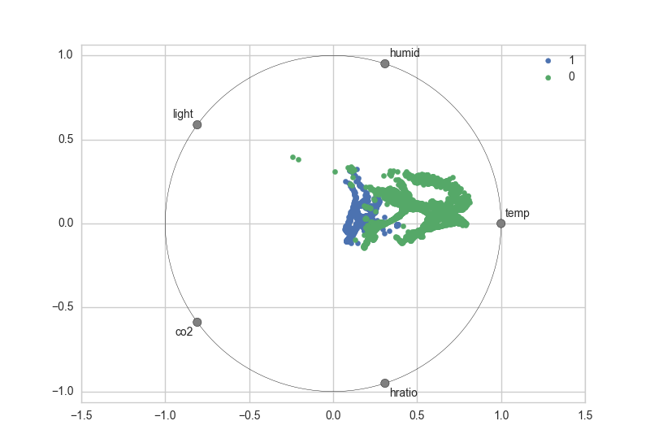
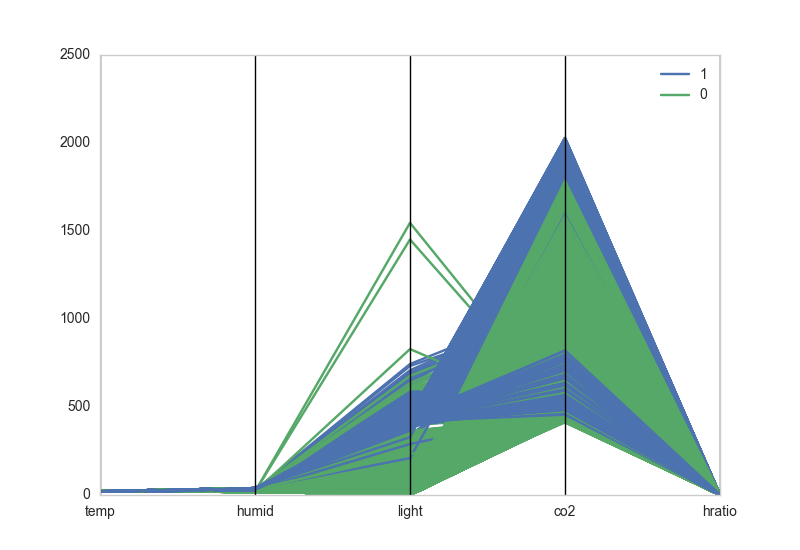
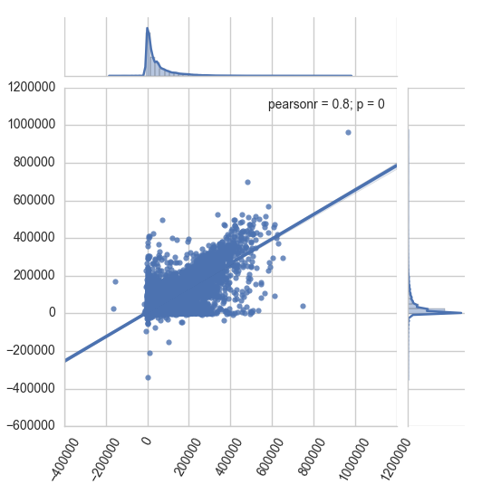

# Visual Diagnostics for More Informed Machine Learning, Part 1: Feature Analysis

> How could they see anything but the shadows if they were never allowed to move their heads?
>
> &mdash; <cite> Plato [_The Allegory of the Cave_](http://classics.mit.edu/Plato/republic.8.vii.html)</cite>


Python and high level libraries like Scikit-learn, TensorFlow, NLTK, PyBrain, Theano, and MLPY have made machine learning accessible to a broad programming community that might never have found it otherwise. With the democratization of these tools, there is now a large, and growing, population of machine learning practitioners who are primarily self-taught. At the same time, the stakes of machine learning have never been higher; predictive tools are driving decision-making in every sector, from business, art, and engineering to education, law, and defense.

How do we ensure our predictions are valid and robust in a time when these few lines of Python &hellip;

```python
from sklearn.linear_model import LinearRegression
model = LogisticRegression()
model.fit(X,y)
model.predict(X)
```

&hellip; can instantiate and fit a model? How do you build intuition around what initial model to select? Which features do you use? Which should you normalize? How do you identify problems like local minima and overfit? Can you get a weak model to perform better?

To help us think through these questions, let's take a look at the following four 2-dimensional arrays, imagining that we want to produce predictive models for each:    

```python
import numpy as np

i   = np.array([
    [10.0, 8.0, 13.0, 9.0, 11.0, 14.0, 6.0, 4.0, 12.0, 7.0, 5.0],
    [8.04, 6.95, 7.58, 8.81, 8.33, 9.96, 7.24, 4.26, 10.84, 4.82, 5.68]
])

ii  = np.array([
    [10.0, 8.0, 13.0, 9.0, 11.0, 14.0, 6.0, 4.0, 12.0, 7.0, 5.0],
    [9.14, 8.14, 8.74, 8.77, 9.26, 8.10, 6.13, 3.10, 9.13, 7.26, 4.74]
])

iii = np.array([
    [10.0, 8.0, 13.0, 9.0, 11.0, 14.0, 6.0, 4.0, 12.0, 7.0, 5.0],
    [7.46, 6.77, 12.74, 7.11, 7.81, 8.84, 6.08, 5.39, 8.15, 6.42, 5.73]
])

iv  = np.array([
    [8.0, 8.0, 8.0, 8.0, 8.0, 8.0, 8.0, 19.0, 8.0, 8.0, 8.0],
    [6.58, 5.76, 7.71, 8.84, 8.47, 7.04, 5.25, 12.50, 5.56, 7.91, 6.89]
])
```

What kind of model should we use to fit our data? Let's compute some statistical properties for each: the mean and variance, the correlation coefficient, and the slope and intercept of their linear regression.

```python
from scipy import stats

def get_stats(twoDarray):
    print(np.mean(twoDarray[0]))
    print(np.mean(twoDarray[1]))
    print(np.var(twoDarray[0]))
    print(np.var(twoDarray[1]))
    print(np.corrcoef(twoDarray[0],twoDarray[1]))
    print(stats.linregress(twoDarray[0],twoDarray[1]))


for data in (i, ii, iii, iv):
    get_stats(data)
```

When you run the above code, you discover that the four arrays have the same descriptive statistical properties. This might lead us to decide to use a single model for each, maybe `sklearn.linear_model.LinearRegression`? And yet, if we were to plot the points for each of the datasets, we would see that they are not at all alike:    



```python
def make_plot(a, b, c, d):
    fig, ((axa, axb), (axc, axd)) =  plt.subplots(2, 2, sharex='col', sharey='row')
    for arr, ax in ((a, axa), (b, axb), (c, axc), (d, axd)):
        x = arr[0]
        y = arr[1]

        ax.scatter(x, y, c='g')
        m,b = np.polyfit(x, y, 1)
        X = np.linspace(ax.get_xlim()[0], ax.get_xlim()[1], 100)
        ax.plot(X, m*X+b, '-')
    plt.show()

make_plot(i, ii, iii, iv)
```  

More importantly, a simple linear regression model is not going to perform equally well on each. While we can see a linear relationship in _i_ and _iii_, their regression lines are substantially different. In the _ii_ plot, we can see that the variables are related but not linearly correlated, and also that they are not normally distributed. Moreover, both the _iii_ and the _iv_ datasets contain outliers big enough to strongly influence the correlation coefficients.

Assembled by English statistician Frank Anscombe in 1973, the takeaway from these four datasets, known as [Anscombe's Quartet](https://en.wikipedia.org/wiki/Anscombe%27s_quartet), and their corresponding visualizations is that of all of the analytical tools at our disposal, sometimes our eyes are the most important. In data science, visual diagnostics are a powerful but frequently underestimated tool. Visualizations don't have to be the end of the pipeline. They can allow us to find patterns we simply cannot see by looking at raw data alone. Where static outputs and tabular data may render patterns opaque, human visual analysis can uncover volumes and lead to more robust programming and better data products.

In machine learning, where lots of things can cause trouble (messy data, overtraining, undertuning, the curse of dimensionality, etc.) visual diagnostics can mean the difference between a model that crashes and burns, and one that predicts the future. In this series of posts on 'Visual Diagnostics for More Informed Machine Learning,' I'd like to show how visualization tools can offer analytical support at several key stages in the machine learning process. I'll demonstrate how to deploy some of the visualization tools from the standard Scikit-Learn and Matplotlib libraries (along with a few tricks from Pandas, Bokeh, and Seaborn) and illustrate how these diagnostics can support the machine learning workflow, including feature analysis, model selection, and parameter tuning.

## A Range of Datasets  

In order to explore these visualization methods in a variety of contexts, we'll be using a few different datasets from the [UCI Machine Learning Repository](http://archive.ics.uci.edu/ml/):

1. [Detecting room occupancy](http://archive.ics.uci.edu/ml/datasets/Occupancy+Detection+) from light, humidity, CO2, etc.    
2. [Predicting default in credit card clients](http://archive.ics.uci.edu/ml/datasets/default+of+credit+card+clients) from sex, education, marital status, age, and payment history.     
3. [Predicting concrete compressive strength](http://archive.ics.uci.edu/ml/datasets/Concrete+Compressive+Strength) from its age and ingredients.   

Here is a simple script that uses the Python `requests` module to go to the UCI page to fetch all three:

```python
import os
import zipfile
import requests

OCCUPANCY = 'http://bit.ly/24PSLer'
CREDIT    = 'http://bit.ly/1UYuqAk'
CONCRETE  = 'http://bit.ly/1rJIH8x'

def download_data(url, path='data'):
    if not os.path.exists(path):
        os.mkdir(path)

    response = requests.get(url)
    name = os.path.basename(url)
    with open(os.path.join(path, name), 'w') as f:
        f.write(response.content)


for href in (OCCUPANCY, CREDIT, CONCRETE):
    download_data(href)


# Extract the occupancy zip data
z = zipfile.ZipFile(os.path.join('data', 'occupancy_data.zip'))
z.extractall(os.path.join('data', 'occupancy_data'))
```

By running this script you should find a directory called `data` in your current working directory, containing two XLS (Excel) files, a zip file, and a directory containing the unzipped room occupancy data.

## More Intuitive Feature Analysis and Selection

Feature selection is key to successful machine learning. It's a safe bet that with our three sample datasets, some feature selection had already been done before they were uploaded to the UCI repository. But when doing machine learning in the wild, we often have to do that feature selection from scratch using a combination of statistical and other methods (e.g. talking with domain experts, using visual analysis). In these real-world scenarios, we anticipate that perhaps only some attributes may be predictive (and only if we are lucky!) and that others may not be predictive at all. We also anticipate situations where there is redundancy across attributes (e.g. one is a linear combination of two others).    

With feature selection, our goal is to find the _smallest_ set of the available features such that the fitted model will reach it's maximal predictive value. Why? Firstly, minimizing the number of features we include lowers the complexity of the model, in turn reducing bias. Secondly, lower dimensional data takes a lot less computation time. Finally, in practice, models based on smaller sets of variables are frequently also more interpretable.     

Statistical measures like mean and variance are a very useful first step to unpacking the features to prepare for selection. Now that we've got our data, let's import `pandas`, load each into a data frame and take a quick look:

```python
import pandas as pd

# Load the room occupancy dataset
occupancy = os.path.join('data','occupancy_data','datatraining.txt')
occupancy = pd.read_csv(occupancy, sep=',')
occupancy.columns = [
    'date', 'temp', 'humid', 'light', 'co2', 'hratio', 'occupied'
]

# View the occupancy details
print(occupancy.head())
print(occupancy.describe())

# Load the credit card default dataset
credit = os.path.join('data','default%20of%20credit%20card%20clients.xls')
credit = pd.read_excel(credit, header=1)
credit.columns = [
    'id', 'limit', 'sex', 'edu', 'married', 'age', 'apr_delay', 'may_delay',
    'jun_delay', 'jul_delay', 'aug_delay', 'sep_delay', 'apr_bill', 'may_bill',
    'jun_bill', 'jul_bill', 'aug_bill', 'sep_bill', 'apr_pay', 'may_pay', 'jun_pay',
    'jul_pay', 'aug_pay', 'sep_pay', 'default'
]

# View the credit details
print(credit.head())
print(credit.describe())

# Load the concrete compression data set
concrete   = pd.read_excel(os.path.join('data','Concrete_Data.xlsx'))
concrete.columns = [
    'cement', 'slag', 'ash', 'water', 'splast',
    'coarse', 'fine', 'age', 'strength'
]

# View the concrete details
print(concrete.head())
print(concrete.describe())
```

We can start to get a feel for the differences across our three datasets from the output of the `.describe()` statements above. For example, in the occupancy dataset, the standard deviations for light and CO2 emissions are two orders of magnitude greater than they are for temperature and humidity, meaning that some scaling may be necessary. In the credit card default dataset, the distribution of the labels (0 for credit card holders who did not default on the payment and 1 for those who did) appears uneven, which can be an indicator of possible class imbalance.  

However, if you had to select which features were most likely to be predictive based solely on the descriptive tables, it would be pretty tough, especially without domain expertise (what the heck is superplasticity?). At this point, those with some experience with predictive modeling will often begin to visualize the data so that they can see the behavior of the different feature vectors. Below we'll explore our three datasets using some common approaches to visualizing features, including:    

 - boxplots (and violinplots)
 - histograms
 - scatter plot matrices (sploms)
 - radial visualizations (radviz)
 - parallel coordinates
 - jointplots

As we're exploring the graphs, the two key things we want to be looking for are signal (e.g. broadly speaking, patterns, separability, relationships between our features and our targets, relationships between different features, etc.) and volatility (e.g. amount of noise, distribution of data, etc.).    


### Boxplots

Boxplots (or 'box-and-whisker' plots) enable us to look at the central tendency of the data, see the distribution, and examine outliers. In the example below, each feature of the concrete dataset is listed out on the x-axis and for each feature, we get to visualize the data's behavior. The boxes indicate the upper and lower quartiles of the data, the black line in the center of each box indicates the median, the whiskers show the biggest and smallest values (with the outliers excluded), and the diamonds show the outliers. A boxplot of our concrete dataset (shown below, along with the code needed to generate it) shows us that most of the features are on a similar scale, with the exception of 'coarse' and 'fine'. This suggests that we may want to rescale our features before we begin modeling.

   

```python
import seaborn as sns
import matplotlib.pyplot as plt

sns.set_style('whitegrid')

def box_viz(df):
    ax = sns.boxplot(df)
    plt.xticks(rotation=60)
    plt.show()

box_viz(concrete)
```

[Violinplots](https://stanford.edu/~mwaskom/software/seaborn/generated/seaborn.violinplot.html) are a nice alternative to traditional box-and-whiskers, because they provide the same information but also reflect relative kernel density estimates, which can be useful when looking for separability. Additionally, the two sides of the violin can be used to show relative distributions of categorical variables (particularly useful for binary classifiers)! Use `sns.violinplot` instead of `sns.boxplot` to generate these types of figures.

### Histograms

Histograms enable us to bin values of individual features into buckets and visualize the domain of the feature by exposing the frequency of values as the relative size of each bucket. Below is a histogram which plots the age feature of the credit card default dataset, as well as the code needed to generate the graph. One notable observation from this visualization is that most of the people represented in the data are under the age of 40.



```python
def hist_viz(df,feature):
    ax = sns.distplot(df[feature])
    plt.xlabel(feature)
    plt.show()

hist_viz(credit,'age') # We need to specify a feature vector
```

### Scatter Plot Matrices (Sploms)

Scatterplot matrices (or 'sploms') are one of my favorite feature analysis tools. With sploms, we plot all of the pairwise scatterplots of the features in a single matrix, where the diagonal is generally left blank or used to display kernel density estimates, histograms, or feature labels. Sploms are a way to check the pairwise relationships between features. When we look at a scatterplot matrix, we are looking for covariance, for relationships that appear to be linear, quadratic, or exponential, and for either [homoscedastic](https://en.wikipedia.org/wiki/Homoscedasticity) or [heteroscedastic](https://en.wikipedia.org/wiki/Heteroscedasticity) behavior that will tell us how the features are dispersed relative to each other. In the scatterplot for the concrete dataset below, we can see what appears to be heteroscedastic behavior in the pairwise plot of strength and cement content.  



Note that the Seaborn function for a scatterplot matrix is called `sns.pairplot`:    
```python
def splom_viz(df, labels=None):
    ax = sns.pairplot(df, hue=labels, diag_kind='kde', size=2)
    plt.show()

splom_viz(concrete)
```

### Radial Visualization (Radviz)

Radial visualizations are based on a spring tension minimization algorithm. The features of the dataset are equally spaced on a unit circle and the instances are dropped into the center of the circle. The features then 'pull' the instances towards their position on the circle in proportion to their normalized numerical value for that instance. In the radviz graph for the occupancy dataset below, we can see that there is some definite separation between the rooms that are labeled as occupied and those that are vacant. Moreover, it appears that temperature seems to be one of the more predictive features, given how strongly the green dots (the unoccupied rooms) are being 'pulled' towards that part of the circle.

  

As of this writing, radial visualizations are not yet available in Seaborn, so we can use the Pandas `radviz` function together with the Seaborn `sns.color_palette` to maintain a consistent look:    
```python
from pandas.tools.plotting import radviz

def rad_viz(df,labels):
    fig = radviz(df, labels, color=sns.color_palette())
    plt.show()

rad_viz(occupancy.ix[:,1:],'occupied') # Specify which column contains the labels
```

### Parallel Coordinates

Parallel coordinates, like radviz plots, are a way to visualize clusters in data. Data points are represented as connected line segments. The x-axis units are not meaningful, and instead, each vertical line represents one attribute. One set of connected line segments represents one instance. Points that tend to cluster will appear closer together, and we look for thick chords or braids of lines of the same color that would indicate good class separability.

    

As with radial visualization, we must resort to using the Pandas function `parallel_coordinates`:
```python
from pandas.tools.plotting import parallel_coordinates

def pcoord_viz(df, labels):
    fig = parallel_coordinates(df, labels, color=sns.color_palette())
    plt.show()

pcoord_viz(occupancy.ix[:,1:],'occupied') # Specify which column contains the labels
```

Feature analysis can be a big challenge as the dimensionality of the data increases, even for experts. Frankly, there aren't a lot of tools out there for dealing with high-dimensional data. As they are currently implemented in Python, neither radviz nor parallel coordinates scale particularly well to very high dimensional data (although making them more interactive, e.g. enabling the user to drag features in and out of the graph, would help!).


### Jointplots

Generally speaking, the number of dimensions must be reduced through techniques such as hierarchical aggregation, dimensionality reduction (like PCA and LDA), and dimensional subsetting. For dimensional subsetting, one visual tactic is to use the scatterplot matrix approach to generate small multiples; another is to do a series of independent jointplots to examine the relationships and correlations between each possible pair of features.

In the jointplot below (for which I've also provided the code), we can examine the relationship between the amounts of individuals' first bill in April and their last bill in September.



```python
def joint_viz(feat1,feat2,df):
    ax = sns.jointplot(feat1, feat2, data=df, kind='reg', size=5)
    plt.xticks(rotation=60)
    plt.show()

joint_viz('apr_bill','sep_bill',credit)
```

## Conclusion   

Feature analysis is a critical part of machine learning, and it does increase significantly in complexity as the number of potential features increases. But as I hope I've illustrated, feature selection doesn't have to be mysterious. Statistical tools like correlation coefficients (seen in the jointplot above) and LASSO (which we'll explore a bit more in Part 2) are very useful tools for identifying the smallest set of maximally predictive features. The advantage of using tools like boxplots, histograms, and sploms _in concert_ with statistical methods is that they enable us to incorporate visual analysis to help build intuition. Just as Anscombe's quartet illustrates the power of visualizations to unlock insights about data, visual feature selection opens up insight into our data. This is particularly useful for those getting started with machine learning (and can also help with seasoned machine learning practitioners who are modeling data in a new domain space).

Through the course of our visual exploration of the datasets on room occupancy, credit card default, and concrete we've developed a much better sense of what we want to be predicting, and also of which features will help us to do that. In addition to being a practical and accessible way to augment the feature analysis process, visual tools can help guide us toward selecting the right machine learning algorithm for the job. In Part 2, we'll continue exploring our three datasets and discuss how visualizations can facilitate the model selection process.

Read Part 2 of this post: Coming soon!


### Resources and Helpful Links

- [Visualizing Statistical Models: Removing the Blindfold by Hadley Wickham et al.](http://had.co.nz/stat645/model-vis.pdf)
- [Model Selection Management Systems by Arun Kumar et al.](http://pages.cs.wisc.edu/~arun/vision/)
- [A Visual Introduction to Machine Learning](http://www.r2d3.us/visual-intro-to-machine-learning-part-1/)
- [The Scikit-Learn Algorithm Cheatsheet](http://scikit-learn.org/stable/tutorial/machine_learning_map/)
- [Visualizing Machine Learning Thresholds](http://blog.insightdatalabs.com/visualizing-classifier-thresholds/)     
- [ML Demos](http://mldemos.epfl.ch/)
- [Plotting SVM Classifiers](http://scikit-learn.org/stable/auto_examples/svm/plot_iris.html#example-svm-plot-iris-py)
- [Introduction to ROC Analysis](https://ccrma.stanford.edu/workshops/mir2009/references/ROCintro.pdf)    
- [Visualizing Representations](http://colah.github.io/posts/2015-01-Visualizing-Representations/)    
- [Accurately Measuring Model Prediction Error](http://scott.fortmann-roe.com/docs/MeasuringError.html)    
- [Understanding the Bias-Variance     Tradeoff](http://scott.fortmann-roe.com/docs/BiasVariance.html)
