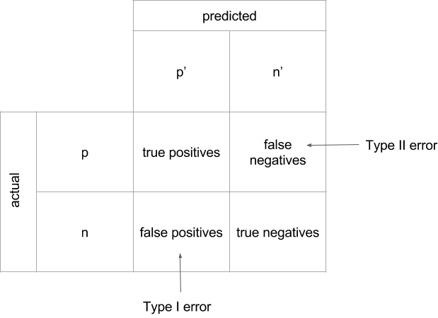

# Visual Diagnostics for More Informed Machine Learning, Part 3: Visual Evaluation and Parameter Tuning

_Note: Before starting Part 3, be sure to read Part 1 and Part 2!_

Welcome back! In this final installment of 'Visual Diagnostics for More Informed Machine Learning,' we'll close the loop on visualization tools for navigating the different phases of the machine learning workflow.  Recall that we are framing the workflow in terms of the 'model selection triple' &mdash; this includes analyzing and selecting features, experimenting with different model forms, and evaluating and tuning fitted models. So far we've covered methods for visual feature analysis in Part 1 and for model family and form exploration in Part 2. This post will cover evaluation and tuning, so we'll begin with two questions:     
 1. How do you know when your machine learning model is working?    
 2. How can you make it work better?    

Let's start with the first question.

## Tools for Evaluation
You've probably heard other machine learning practitioners talking about their F1 scores or their R<sup>2</sup> value. Generally speaking, we do tend to rely on numeric scores to tell us when our models are performing well or poorly. There are a number of measures we can use to evaluate our fitted models.

As you've probably guessed, I'm going to propose using visualizations in combination with the numeric scores to build better intuition around performance. In the next few sections, I'll share some of the tools I have found useful in my own learning. The overarching idea I want to convey is that that a single score, or even a single plot, is not enough. It isn't useful to think of machine learning models as 'good' or 'bad' devoid of context. A model is good if it manages to use the smallest set of features that produce the most predictive model. A fitted model is good if it's better than the results you get from fitting another model form, or if it's better than the model you used to make predictions yesterday. And later in the post, when we move to answering the second of our two questions, we'll say that a model is good when it's instantiated using the specific combination of hyperparameters that result in its best performing version.

In the previous section, when we ran each of our models, the outputs were some of the standard metrics (`confusion_matrix`, `mean_squared_error`, `r2_score`) that are routinely used to determine how well a classifier or regressor is performing. But those are only a few of the options available. Below are a few of the most common ones, along with their interpretations and function calls in Scikit-Learn,

&hellip; for classification:

| Metric | Measures | In Scikit-learn |
|--------|----------|-----------------|
| Precision | How many selected are relevant? | from sklearn.metrics import precision_score |
| Recall | How many relevant were selected? | from sklearn.metrics import recall_score |
| F1 | Weighted average of precision & recall | from sklearn.metrics import f1_score |
| Confusion Matrix | True positives, true negatives, false positives, false negatives | from sklearn.metrics import confusion_matrix |
| ROC | True positive rate vs. false positive rate, as classification threshold varies | from sklearn.metrics import roc |
| AUC | Aggregate accuracy, as classification threshold varies | from sklearn.metrics import auc |


&hellip; and for regression:

| Metric | Measures | In Scikit-learn |
|--------|----------|-----------------|
| Mean Square Error (MSE, RMSE) | distance between predicted values and actual values (more sensitive to outliers) | from sklearn.metrics import mean_squared_error |
| Absolute Error (MAE, RAE) | distance between predicted values and actual values (less sensitive to outliers) | from sklearn.metrics import mean_absolute_error, median_absolute_error |
| Coefficient of Determination (R<sup>2</sup>) | % of variance explained by the regression; how well future samples are likely to be predicted by the model | from sklearn.metrics import r2_score |

Next we'll delve into these metrics with a bit more depth and explore how to deploy visualization tools from Scikit-Learn to better 'see' how our models are performing.

### Evaluating Classifiers

When we evaluate our classifiers for room occupancy and credit card default, the implicit question we are asking is how well our predicted values matched the actual labeled values for both sets. But within this notion of 'how well' there are a lot of possibilities. For instance, there are two ways to be right: we can be right if our classifier correctly identifies cases where a room was occupied or when a credit card customer defaulted on their payment. These are called 'true positives'. But we can also be right by correctly identifying vacant rooms and cases where credit card customers successfully paid off their debt (i.e. 'true negatives').

Likewise, there is more than one way to be wrong &mdash; by labeling a room vacant that is actually occupied (or by labeling a client as a defaulter when they actually paid), or by labeling a room occupied when it is actually empty (or by identifying a customer as having paid their bill when they actually defaulted). The first type of error is a 'false positive' (or sometimes 'type I error'), and the second is a 'false negative' (or 'type II error').

In the specific, there are going to be cases where we'll care a great deal more about being wrong (or right) in one way than in another. But in a generalized case, we'd ideally like to be able to tell how we did along _all_ of those parameters. Enter the confusion matrix &hellip;

#### Confusion Matrices



Scikit-Learn comes with a built-in function for generating confusion matrices, `sklearn.metrics.confusion_matrix`, which takes as an argument the actual values from the dataset and the predicted values generated by the fitted model, and outputs a confusion matrix. Our `classify` function from Part 2 is a wrapper for the Scikit-Learn function, and when you run the code you end up with something like looks like this:

```python
[[1238   19]   # True Positives = 1238, False Negatives = 19
 [   2  370]]  # False Positives = 2, True Negatives = 370
```

True to their name, confusion matrices can sometimes be a bit difficult to unpack, particularly the more classes you have. Instead, I often prefer using a classification report &hellip;

### Classification Reports
Classification reports include the same basic information as in a confusion matrix, but with several added advantages. First, where the confusion matrix merely labels whether instances have be classified properly or improperly, a classification report provides three different evaluation metrics: precision, recall, and F1 score. Moreover, the classification report can conveniently include the names of the labels for each of the classes, which helps a lot with interpretability. Making one is as simple as:   

```python
from sklearn.metrics import classification_report

print(classification_report(y_true, y_pred, target_names=target_names))
```

However, with some gentle manipulation of the built-in classification report metric from Scikit-Learn, we can also integrate a color-coded heatmap that will help guide our eye towards our predictive successes (the oranges) and weaknesses (the greys). In my code below I've used a custom colormap, but you can use whichever colors you find most informative.


```python
from matplotlib import colors
from matplotlib.colors import ListedColormap

ddl_heat = ['#DBDBDB','#DCD5CC','#DCCEBE','#DDC8AF','#DEC2A0','#DEBB91',\
            '#DFB583','#DFAE74','#E0A865','#E1A256','#E19B48','#E29539']
ddlheatmap = colors.ListedColormap(ddl_heat)

def plot_classification_report(cr, title=None, cmap=ddlheatmap):
    title = title or 'Classification report'
    lines = cr.split('\n')
    classes = []
    matrix = []

    for line in lines[2:(len(lines)-3)]:
        s = line.split()
        classes.append(s[0])
        value = [float(x) for x in s[1: len(s) - 1]]
        matrix.append(value)

    fig, ax = plt.subplots(1)

    for column in range(len(matrix)+1):
        for row in range(len(classes)):
            txt = matrix[row][column]
            ax.text(column,row,matrix[row][column],va='center',ha='center')

    fig = plt.imshow(matrix, interpolation='nearest', cmap=cmap)
    plt.title(title)
    plt.colorbar()
    x_tick_marks = np.arange(len(classes)+1)
    y_tick_marks = np.arange(len(classes))
    plt.xticks(x_tick_marks, ['precision', 'recall', 'f1-score'], rotation=45)
    plt.yticks(y_tick_marks, classes)
    plt.ylabel('Classes')
    plt.xlabel('Measures')
    plt.show()

cr = classification_report(y_true, y_pred)
plot_classification_report(cr)
```

Easier to interpret, right? One of the things that I find helpful about the classification heatmap is that it makes me reflect on my relative tolerance for type I vs. type II errors for the given problem. On the other hand, one thing that the code above does not do is allow for comparison _across_ models, which is important to evaluating the performance of a fitted model. For that reason, in this post we'll be using a slightly different version of the prediction functions (`classify` and `regress`) that we developed in Part 2.

The advantage of the `get_preds` function below is that it outputs a tuple with the actual labeled (e.g. expected) values and the predicted values generated by the fitted model. This tuple form will make it easier for us to do different kinds of visual comparisons across fitted models so that we can decide for ourselves which is the best.

```python
def get_preds(attributes, targets, model):
    '''
    Executes classification or regression using the specified model
    and returns expected and predicted values.
    Useful for comparison plotting!
    '''
    splits = cv.train_test_split(attributes, targets, test_size=0.2)
    X_train, X_test, y_train, y_test = splits

    model.fit(X_train, y_train)
    y_true = y_test
    y_pred = model.predict(X_test)
    return (y_true,y_pred)
```

#### ROC Curves

Another way to examine the performance of our classifiers is with the Receiver Operating Characteristic (ROC). We can import `roc_curve` from the Scikit-Learn metrics module and in order to get a numeric calculation of the true positive and false positive rates, as well as the thresholds. Even better, we can plot the ROC to visualize the tradeoff between our classifier's sensitivity (how well it is optimized to find true positives) and its specificity (how well it is optimized to avoid false positives).

In the plot (code provided as well), the x-axis indicates the false positive rate and the y-axis shows the true positive rate. We have the added advantage of being able to compare the performance of two different fitted models, and we can see that the `KNeighborsClassifier` has outperformed the `LinearSVC` classifier.


```python
def roc_compare_two(y, yhats, models):
    f, (ax1, ax2) = plt.subplots(1, 2, sharey=True)
    for yhat, m, ax in ((yhats[0], models[0], ax1), (yhats[1], models[1], ax2)):
        false_positive_rate, true_positive_rate, thresholds = roc_curve(y,yhat)
        roc_auc = auc(false_positive_rate, true_positive_rate)
        ax.set_title('ROC for %s' % m)
        ax.plot(false_positive_rate, true_positive_rate, \
                c='#2B94E9', label='AUC = %0.2f'% roc_auc)
        ax.legend(loc='lower right')
        ax.plot([0,1],[0,1],'m--',c='#666666')
    plt.xlim([0,1])
    plt.ylim([0,1.1])
    plt.show()

y_true_svc, y_pred_svc = get_preds(stdfeatures, labels, LinearSVC())
y_true_knn, y_pred_knn = get_preds(stdfeatures, labels, KNeighborsClassifier())

actuals = np.array([y_true_svc,y_true_knn])
predictions = np.array([y_pred_svc,y_pred_knn])
models = ['LinearSVC','KNeighborsClassifier']

roc_compare_two(actuals, predictions, models)
```

Generally speaking, if your ROC curve is a straight horizontal line, your classifier is perfect (which should make you a bit skeptical about your data &hellip;). If your curve is pulling a lot toward to the upper left corner, your classifier has good accuracy. If your curve is exactly aligned with the diagonal, your classifier is about as effective as a random coin toss. We have also calculated the area under curve (AUC) and integrated that into our plot. As I mentioned above, what matters most is relative AUC (i.e. how much better or worse the calculated AUC is for one model compared to another). But generally speaking, if the AUC is greater than .80, I have the sense that my classifier is very strong. If my AUC is between .60 - .80, my classifier is good, but might be better if I kept tuning or changed model forms. An AUC of less than .60 might lead me to question whether the features I am using are actually predictive.


### Evaluating Regressors

Let's say we want to experiment with a few different models for our concrete dataset and then determine which one performs the best. In the Part 2 examples, the output for `regress` was presented in terms of the mean squared errors and coefficients of determination (R<sup>2</sup>), which looked something like this:

```text
Mean squared error = 116.268
R2 score = 0.606
```

The numeric scores are helpful, particularly when we are able to compare mean squared error and <sup>R</sup> across different fitted models. But they don't give us a good feel for _why_ a certain model is outperforming another, and they don't tell us how to tune the parameters of our models so that we can improve the scores. Next we'll see two visual evaluation techniques that can help us with diagnosing regression model deficiencies: prediction error plots and residual plots.

#### Prediction Error Plots

To get a sense of how often our model is predicting values that are close to the expected values, we'll plot the actual labels from the concrete dataset (which indicates the strength of the concrete) against the predicted value generated by each of our models. Below is a plot of the error for three different fitted regression models on our concrete dataset: `Ridge`, `SVR`, and a wildcard [`RANSACRegressor`](http://scikit-learn.org/stable/modules/generated/sklearn.linear_model.RANSACRegressor.html). What we're looking for here is a clear relationship between the predicted and actual values. We can see that both of the linear models perform fairly well (though not identically), while the support vector machine model is a flop:


```python
def error_compare_three(mods,X,y):
    f, (ax1, ax2, ax3) = plt.subplots(3, sharex=True, sharey=True)
    for mod, ax in ((mods[0], ax1),(mods[1], ax2),(mods[2], ax3)):
        predicted = cv.cross_val_predict(mod[0], X, y, cv=12)
        ax.scatter(y, predicted, c='#F2BE2C')
        ax.set_title('Prediction Error for %s' % mod[1])
        ax.plot([y.min(), y.max()], [y.min(), y.max()], 'k--', lw=4, c='#2B94E9')
        ax.set_ylabel('Predicted')
    plt.xlabel('Measured')
    plt.show()

models = np.array([(Ridge(),'Ridge'), (SVR(),'SVR'), (RANSACRegressor(),'RANSAC')])
error_compare_three(models, features, labels)
```

#### Residual Plots

A residual is the difference between the labeled value and the predicted value for each instance in our dataset. We can plot residuals to visualize the extent to which our model has captured the behavior of the data. By plotting the residuals for a series of instances, we can check whether they're consistent with random error; we should not be able to predict the error for any given instance. If the data points appear to be evenly (randomly) dispersed around the plotted line, our model is performing well. What we're looking for is a mostly symmetrical distribution with points that tend to cluster towards the middle of the plot, ideally around smaller numbers of the y-axis. If we observe some kind of structure that does not coincide with the plotted line, we have failed to capture the behavior of the data and should either consider some feature engineering, selecting a new model, or an exploration of the hyperparameters.


```python
def resids_compare_three(mods,X,y):
    f, (ax1, ax2, ax3) = plt.subplots(3, sharex=True, sharey=True)
    plt.title('Plotting residuals using training (blue) and test (green) data')
    for m, ax in ((mods[0], ax1),(mods[1], ax2),(mods[2], ax3)):
        for feature in list(X):
            splits = cv.train_test_split(X[[feature]], y, test_size=0.2)
            X_tn, X_tt, y_tn, y_tt = splits
            m[0].fit(X_tn, y_tr)
            ax.scatter(m[0].predict(X_tn),m[0].predict(X_tn)-y_tn,c='#2B94E9',s=40,alpha=0.5)
            ax.scatter(m[0].predict(X_tt), m[0].predict(X_tt)-y_tt,c='#94BA65',s=40)
        ax.hlines(y=0, xmin=0, xmax=100)
        ax.set_title(mod[1])
        ax.set_ylabel('Residuals')
    plt.xlim([20,70])        # Adjust according to your dataset
    plt.ylim([-50,50])       # Adjust according to your dataset
    plt.show()

models = np.array([(Ridge(),'Ridge'), (LinearRegression(),'Linear Regression'), (SVR(),'SVR')])
resids_compare_three(models, features, labels)
```

Every estimator has advantages and drawbacks, which we can think of in terms of its bias (or average error for different training sets), its variance (e.g. how sensitive it is to varying training sets). We can diagnose bias and variance by looking to the particular kinds of structures we observe in plots of non-random residuals. For example, an average value of _y_ that is not zero given thin vertical strips of the graph is indicative of bias.  A plot with points that are not even distributed across the x-axis is evidence of heteroscedastic residuals. Both can often be addressed through hyperparameter tuning (which we'll discuss in the next section) to strengthen the predictive power of the model. If we notice our fitted model has high bias, we can try to add more features, add complexity by picking a more sophisticated model form, or we can decrease the amount of penalty or regularization. If we notice our fitted model has high variance, we can try using fewer features, training on more samples, or increasing regularization. For an excellent visual walkthrough of the bias-variance tradeoff, check out [this essay](http://scott.fortmann-roe.com/docs/BiasVariance.html) by Scott Fortmann-Roe.

This kind of evaluation of our models should flow directly into a reflection on the models we initially selected, in some cases leading us to choose different models. Our model evaluations should also prompt us to consider tuning, which we'll get to in the next section.

### Advanced Machine Learning: Visual Tuning

We started off by asking how we know when a machine learning model is working and how we can make it work better. Now that we've reviewed some methods for assessing how well a model is working, let's next consider what it takes to make a model perform better. As you may have noticed, for every model we have used so far, we have accepted the default Scikit-Learn parameters. For most of our fitted models, the scores were fairly high, so the defaults served us pretty well. But we will not always be so lucky, and getting good at tuning a model by adjusting its parameters, or [hyperparameter tuning](https://en.wikipedia.org/wiki/Hyperparameter_optimization), is the next step to getting good at machine learning.

#### Visualizing Training and Validation

How do you pick the best parameters? One method is to use validation curves to visualize training and validation scores of a model through different values of a single hyperparameter. Let's experiment with a `SVC()` classifier for our credit card default data set. We'll make a validation curve by plotting the training scores and validation scores along different values of the parameter _gamma_.

What we're looking for is the spot with the highest value for both the training and the validation scores. If both scores are low, it's an indication of underfit. If the training score is high but the validation score is low, it's an indication of overfit.

Note that in the code provided below, I've illustrated the execution of validation curves using just the first few columns of the credit default dataset. This was done for speed's sake because the dataset is so high dimensional and because I'm using 6-fold cross-validation. Be prepared for this to take a while IRL:


```python
def plot_val_curve(features, labels, model):
    p_range = np.logspace(-5, 5, 5)

    train_scores, test_scores = validation_curve(
        model, features, labels, param_name='gamma', param_range=p_range,
        cv=6, scoring='accuracy', n_jobs=1
    )

    train_scores_mean = np.mean(train_scores, axis=1)
    train_scores_std = np.std(train_scores, axis=1)
    test_scores_mean = np.mean(test_scores, axis=1)
    test_scores_std = np.std(test_scores, axis=1)

    plt.title('Validation Curve')
    plt.xlabel('$\gamma$')
    plt.ylabel('Score')
    plt.semilogx(p_range, train_scores_mean, label='Training score', color='#E29539')
    plt.semilogx(p_range, test_scores_mean, label='Cross-validation score', color='#94BA65')
    plt.legend(loc='best')
    plt.show()

X = scale(credit[['limit','sex','edu','married','age','apr_delay']])
y = credit['default']
plot_val_curve(X, y, SVC())
```

#### Grid Search Plotting


When it comes to hyperparameter tuning, most people use grid search. Grid search is a brute force mechanism for trying all possible combinations of the algorithm's parameters. By establishing a range of discrete values for multiple hyperparameters, each can be seen as an axis, and the grid is just the set of points representing every combination. Each combination is tested individually and the best is returned.

In our `SVC` model for the credit data set, we can try to improve our accuracy by experimenting with different values for the kernel coefficient  _gamma_ of the radial basis function, as well as for _C_, the penalty parameter of the error term:

```python
from sklearn.grid_search import GridSearchCV

def blind_gridsearch(model, X, y):
    C_range = np.logspace(-2, 10, 5)
    gamma_range = np.logspace(-5, 5, 5)
    param_grid = dict(gamma=gamma_range, C=C_range)
    grid = GridSearchCV(SVC(), param_grid=param_grid)
    grid.fit(X, y)

    print(
        'The best parameters are {} with a score of {:0.2f}.'.format(
            grid.best_params_, grid.best_score_
        )
    )
features = credit[['limit','sex','edu','married','age','apr_delay']]
labels   = credit['default']
blind_gridsearch(SVC(), features, labels)
```

The upside of this approach is that it meets our 'models are only good by comparison' criterion, because it allows us to explore a multitude of different fitted models and pick the very best one. The downside of this approach is that it is a blind search. The best case scenario is that you end up with a better performing model but no additional intuition around its tuning. A common scenario for beginners is ending up without a better model _or_ more intuition.

Here's the problem: with grid search, the effective selection of the initial search range for the parameters requires some understanding of what parameters are available, what those parameters mean, what impact they can have on a model, and what a reasonable search space might be.

Here again, visualizations can offer some help, and instead of using the `blind_gridsearch` function, we can create a `visual_gridsearch`:  


```python
def visual_gridsearch(model, X, y):
    C_range = np.logspace(-2, 10, 5)
    gamma_range = np.logspace(-5, 5, 5)
    param_grid = dict(gamma=gamma_range, C=C_range)
    grid = GridSearchCV(SVC(), param_grid=param_grid)
    grid.fit(X, y)

    scores = [x[1] for x in grid.grid_scores_]
    scores = np.array(scores).reshape(len(C_range), len(gamma_range))

    plt.figure(figsize=(8, 6))
    plt.subplots_adjust(left=.2, right=0.95, bottom=0.15, top=0.95)
    plt.imshow(scores, interpolation='nearest', cmap=ddlheatmap)
    plt.xlabel('gamma')
    plt.ylabel('C')
    plt.colorbar()
    plt.xticks(np.arange(len(gamma_range)), gamma_range, rotation=45)
    plt.yticks(np.arange(len(C_range)), C_range)
    plt.title(
        "The best parameters are {} with a score of {:0.2f}.".format(
        grid.best_params_, grid.best_score_)
    )
    plt.show()

visual_gridsearch(SVC(), features, labels)
```

In the heatmap (coolmap?) above, we can see the combinations of values of _C_ and _gamma_ where our model is doing best. We can compare those combinations with other places on the map where our fitted model performed less well. We can start to see that for our credit card default dataset, there's a sweet spot around the area where _C_ is set to 0.01, which reaches peak performance when _gamma_ is around 1e<sup>-05</sup>.

Methods like `visual_gridsearch` can help sensitize us to the relationships between a model's accuracy scores and it's different hyperparameter values. Yes, hyperparameter tuning is still hard. Some folks spend years in school studying and investigating the complexities of different model parameters. Spinning up that kind of hard-won intuition isn't going to happen overnight, but visualizations can add insight and take grid searching out of the black box.

## Conclusion

Although many of us tend to think of graphs and diagrams as the end phase of the pipeline, visualization has a critical role to play throughout the machine learning process. Many tools are available and already implemented in Scikit-Learn, Matplotlib, Pandas, Bokeh, and Seaborn. Now that you've seen them in action, I hope you'll enjoy experimenting with them and iterating on them for your own data sets! Of course, there are also many tools that don't exist yet &mdash; particularly ones that enable interactive visual steering and feature analysis (like smooth zoom-and-filter implementations of hierarchical aggregation for multi-dimensional data) and hyperparameter tuning (like slick parameter sliders). But these tools are likely not far off, given the explosive growth in machine learning-based applications and the growing demand for [data products](https://districtdatalabs.silvrback.com/the-age-of-the-data-product), so keep your eyes peeled.


### Resources and Helpful Links

- [Visualizing Statistical Models: Removing the Blindfold by Hadley Wickham et al.](http://had.co.nz/stat645/model-vis.pdf)
- [Model Selection Management Systems by Arun Kumar et al.](http://pages.cs.wisc.edu/~arun/vision/)
- [A Visual Introduction to Machine Learning](http://www.r2d3.us/visual-intro-to-machine-learning-part-1/)
- [The Scikit-Learn Algorithm Cheatsheet](http://scikit-learn.org/stable/tutorial/machine_learning_map/)
- [Visualizing Machine Learning Thresholds](http://blog.insightdatalabs.com/visualizing-classifier-thresholds/)     
- [ML Demos](http://mldemos.epfl.ch/)
- [Plotting SVM Classifiers](http://scikit-learn.org/stable/auto_examples/svm/plot_iris.html#example-svm-plot-iris-py)
- [Introduction to ROC Analysis](https://ccrma.stanford.edu/workshops/mir2009/references/ROCintro.pdf)    
- [Visualizing Representations](http://colah.github.io/posts/2015-01-Visualizing-Representations/)    
- [Accurately Measuring Model Prediction Error](http://scott.fortmann-roe.com/docs/MeasuringError.html)    
- [Understanding the Bias-Variance     Tradeoff](http://scott.fortmann-roe.com/docs/BiasVariance.html)
